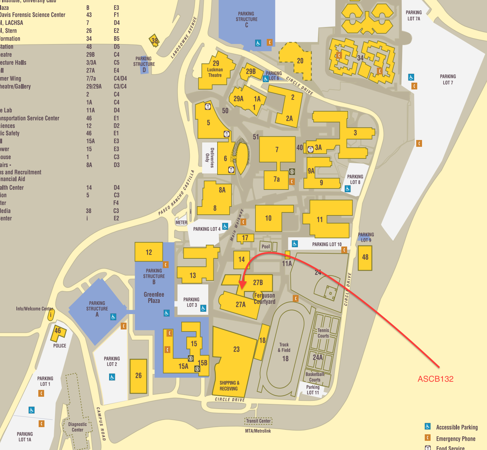

# Week 1: Introduction

## Important Announcements

We are combining all four sessions of Search Engine class all together to 9:10 to 13:00 session at
ASCB 132 (big lecturer hall pass Bios department).

Map:



## Objectives

* [Course logistics](../Syllabus.md)
* [Set up teams](http://goo.gl/forms/5m8DoQySO5)
* Set up Github
* Set up programming environment

## Programming environment

In this class, we will be using Java for the programming parts. Therefore, it is required for you to set up your Java environment.

### Java

Install [OracleJDK 8](http://www.oracle.com/technetwork/java/javase/downloads/index.html) if you don't already have one.

#### Windows User

Click on the link above (OracleJDK 8) to download Java 8. Upon completion of
download, please set up the `PATH` path on your advanced environment settings.

#### Mac User

You can install [brew](http://brew.sh/) and follow the following to install Java 8.

```sh
brew tap caskroom/cask
brew install brew-cask
brew cask install java
```

### Gradle

Install [Gradle](https://gradle.org/) as this will be our primary build tool.

#### Windows User

Click on the link above and install Gradle accordingly. Remember to set up `PATH`
variable so that your terminal knows Gradle is executable.

#### Mac User

Install via `brew install gradle` assuming you have `brew` installed.

#### Linux User

* CentOS users can follow the instruction found in [Github Gist](https://gist.github.com/parzonka/9371885).  
* Ubuntu users take a look at the [Ask Ubuntu Stack Exchange Tutorial](https://askubuntu.com/questions/328178/gradle-in-ubuntu).

#### To check Gradle is installed

Please run `gradle -v` anywhere from terminal. You should see Gradle version as 2.10.

### Wrap Up Java Review Exercise

Download the course repository, run `gradle hello` after you are done. You should see
`Hello Search Engine` as the console output.

After project is working with `gradle hello` above, please run `gradle eclipse` to convert
this project to Eclipse project. Then you can import this folder into Eclipse
(assuming you are using Eclipse) by `File >> Import >> General > Existing project into workspace`

#### Eclipse Gradle plugins

With above being done, you can start modifying your project in Eclipse. However, you are
still not able to run the Gradle tasks. Therefore, you will also need this *Eclipse Gradle Plugin*
to run the Gradle tasks (e.g. hello)

**Instructions to install Gradle plugins in Eclipse**

1. In Eclipse Open Help >> Install New Software
2. Paste a Gradle update site link -- http://dist.springsource.com/release/TOOLS/gradle -- into the "Work with" text box.
3. Click the Add button at the top of the screen.
4. Ensure that the option "Group Items by Category" is enabled.
5. Select the top-level node 'Extensions / Gradle Integration'.
6. Click "Next". This may take a while.
7. Review the list of software that will be installed. Click "Next" again.
8. Review and accept license agreements and Click "Finish".

**Instructions to run Gradle tasks in Eclipse**

1. Right click on the project and click on `Configure` >> `Convert project to Gradle project`.
2. And then you can right click on the project to run Gradle tasks
3. You can now run your project by right click on the project `Run > Gradle build ... (second Gradle build one)` and provide `hello` in the task

#### Recommended readings for Gradle

* http://gradle.org/getting-started-gradle-java/
* http://www.vogella.com/tutorials/Gradle/article.html

### Github

* [Sign up Github account](https://github.com/) if you don't already have one

After finished above two tasks, please download [git](https://git-scm.com/) or
[Github desktop client](https://desktop.github.com/) for you to do source control management.

#### Recommended readings for leaning Git/github

Please read through some of the following readings and have clear understanding of
Github/git in order to commit & push your code for code submission.

* https://help.github.com/articles/good-resources-for-learning-git-and-github/
* [Github cheatsheet](https://education.github.com/git-cheat-sheet-education.pdf)
* [My Github Tutorial from CS-460](https://github.com/csula/cs460-fall-2015/blob/master/documents/misc/github-tutorial.md)

#### Recommended practices

This is not a homework. But I suggest you to start thinking about how you can create
your own main cli based class to do file traversal and information parsing by files
